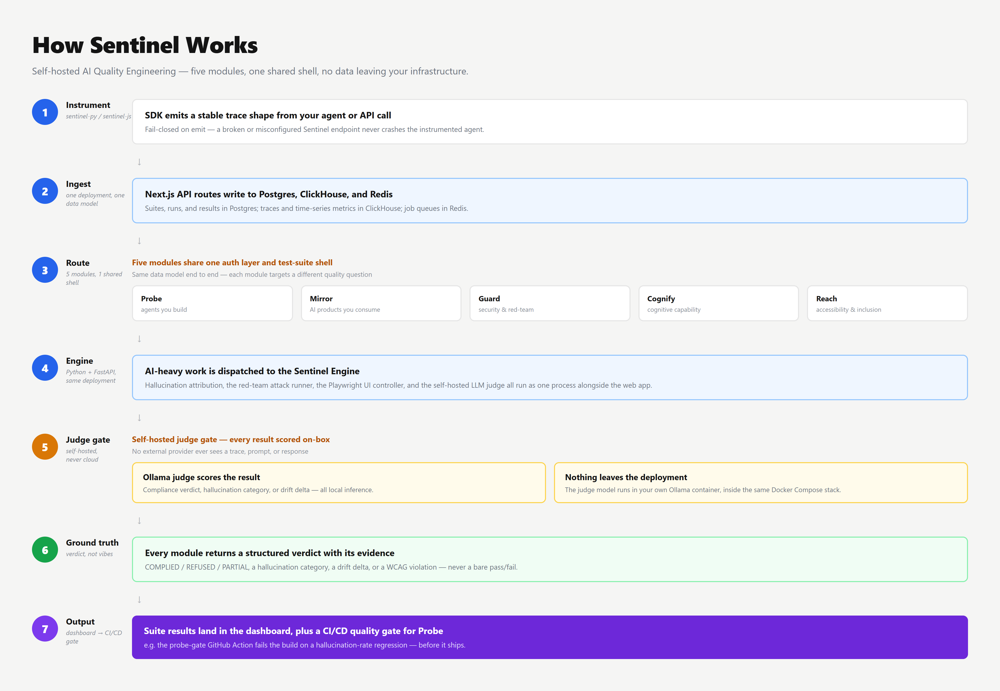
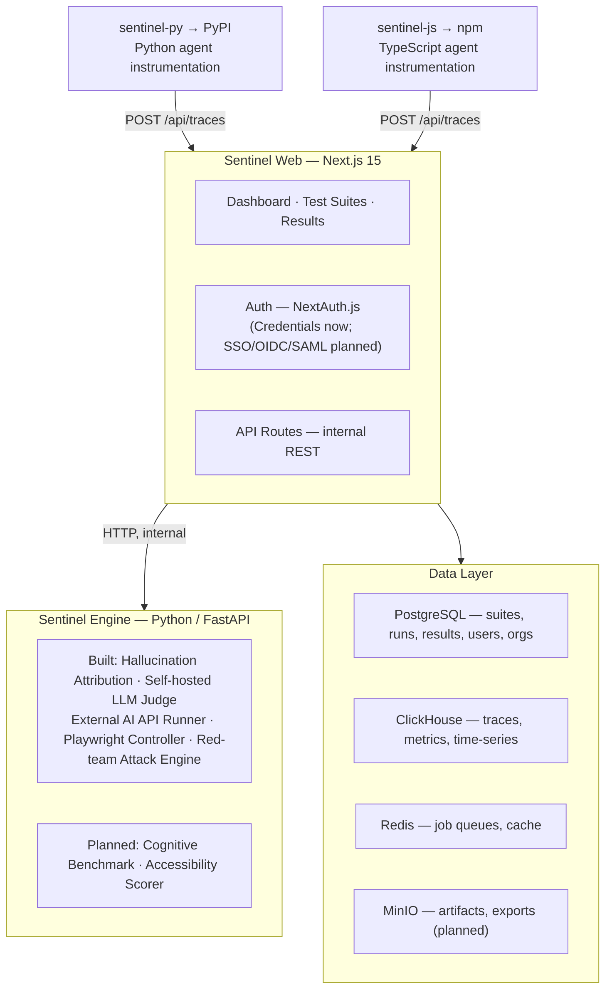

# Sentinel

> Self-hosted AI Quality Engineering platform — trace the agents you build, black-box test the AI products you consume, red-team them, benchmark them against human baselines, and audit them for accessibility. All in one deployment. No data leaves your infrastructure.

> [!NOTE]
> **Status: early, in-progress build (Day 24 of a 50-day plan).** **Probe**
> (agents you build) is functional end-to-end: trace capture via both SDKs,
> tool-call schema validation, a 4-stage hallucination detector backed by a
> self-hosted LLM judge, and a CI/CD quality gate. **Mirror** (AI products
> you consume) is functional end-to-end too: multi-provider API runner,
> LLM-judge quality scoring, model-drift detection, a suite-builder UI, and
> Playwright-driven UI automation (against local fixtures for now, with a
> live-site rollout planned next). **Guard** (security) has begun:
> a 23-prompt single-turn attack library and a live multi-turn attack engine
> (Crescendo, Sequential Jailbreak, Tree Jailbreaking) with self-hosted-judge
> compliance scoring — no external provider API keys exist yet, so real-target
> runs are untested end-to-end. **Cognify and Reach are design-complete but
> not yet implemented.** Expect breaking changes before v1.

<div align="center">



</div>

## The five modules

| Module | What it tests | Covers |
|---|---|---|
| **Probe** | Agents *you build* | OpenTelemetry-style trace capture, tool-call schema validation, hallucination attribution (reasoning/execution/perception/memorization/communication), multi-agent topology graphs, CI/CD quality gates |
| **Mirror** | AI products *you consume* | API behavioral regression across OpenAI/Anthropic/Google/Grok, Playwright-driven UI testing against ChatGPT/Claude.ai/Gemini/Grok, cross-provider benchmarking, cost tracking |
| **Guard** | Security posture | 28+ adversarial red-team attacks, agentic-specific vulnerabilities (goal theft, tool poisoning, memory poisoning), PII leakage detection, GDPR/CCPA checks, OWASP ASI checklist automation |
| **Cognify** | Cognitive capability | Human-baseline task library, multi-dimensional LLM-judge scoring, human-vs-AI comparison, longitudinal capability tracking across model updates |
| **Reach** | Accessibility & inclusivity | Multi-language quality parity (20+ languages), cultural sensitivity and bias detection, reading-level checks, WCAG UI audits |

## Architecture



Modular monolith: all five modules share one data model, auth layer, and
test-suite shell. AI-heavy computation (the self-hosted LLM judge,
red-teaming, Playwright control) runs in the Python engine as a separate
process in the same deployment, so modules can be split into independent
services later without a rewrite.

## Tech stack

| Layer | Technology |
|---|---|
| UI + API shell | Next.js 15 (App Router) + TypeScript |
| AI engine | Python 3.12 + FastAPI + Uvicorn |
| ORM | Prisma (web only — the Python engine has no database access yet) |
| Primary DB | PostgreSQL 16 |
| Metrics DB | ClickHouse |
| Queue | Redis + BullMQ (JS) / Celery (Python) |
| Artifact store | MinIO (S3-compatible) |
| Auth | NextAuth.js v5 (Credentials now; SSO via OIDC/SAML planned) |
| UI components | shadcn/ui + Tailwind CSS |
| Monorepo | pnpm workspaces + Turborepo |
| Python packaging | Poetry |
| Container | Docker Compose (dev/prod) |
| Testing | Vitest (JS) + pytest (Python) |

## Quick start

Prerequisites: Node.js ≥ 20, pnpm ≥ 9, Docker.

```bash
cp .env.example .env

# start Postgres, Redis, MinIO, ClickHouse, Ollama (self-hosted LLM judge), and the Python engine
docker compose -f docker/docker-compose.yml -f docker/docker-compose.dev.yml up -d

# one-time: pull the judge model into the Ollama container
docker exec sentinel_ollama ollama pull llama3.2:3b

pnpm install
pnpm dev          # runs all apps in the monorepo, Next.js on :3000
```

## Development

```bash
pnpm build          # turbo run build
pnpm test           # turbo run test (Vitest across packages)
pnpm lint           # turbo run lint
pnpm check-types    # turbo run check-types

cd apps/engine && poetry install && poetry run pytest   # Python engine tests
```

## Repo layout

```
sentinel/
├── apps/
│   ├── web/            # Next.js 15 app — dashboard, auth, module UIs, API routes
│   └── engine/          # Python FastAPI service — one router per module
├── packages/
│   ├── sentinel-py/     # Agent instrumentation SDK (PyPI)
│   └── sentinel-js/     # Agent instrumentation SDK (npm)
└── docker/              # Compose files for the data layer + engine
```

## Design principles

- **Self-hosted only.** Deploy in your own VPC/cluster; no data leaves your environment.
- **SDK-first trace capture.** Agent instrumentation emits a stable trace shape shared by both SDKs, so instrumentation doesn't change as the backend evolves.
- **Fail closed on emit, not on the app.** SDK failures (network, malformed config) are swallowed at the emit boundary — a broken trace pipe should never crash the instrumented agent.

## License

Not yet licensed — a license will be added before the v1 release. Until then, all rights reserved.

## Contact

Questions or feedback: [its.aks@outlook.com](mailto:its.aks@outlook.com)
